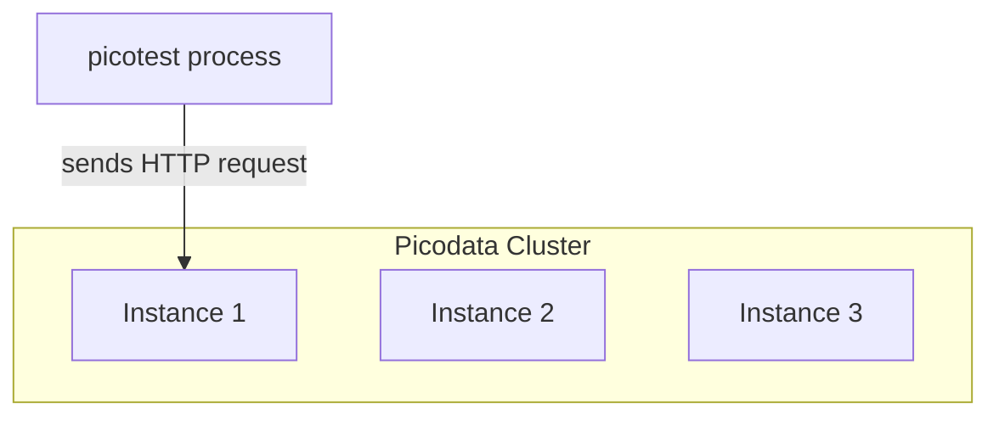
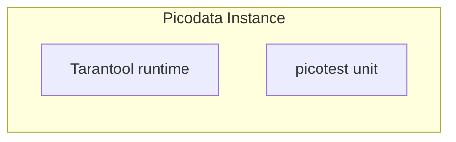

# Test framework for Picodata plugins

[](https://github.com/picodata/picotest/actions/workflows/build-and-test.yml)

- [Test framework for Picodata plugins](#test-framework-for-picodata-plugins)
  - [Описание](#описание)
  - [Совместимость с Picodata](#совместимость-с-picodata)
  - [Интеграционное тестирование](#интеграционное-тестирование)
    - [Использование `#[picotest]`](#использование-picotest)
    - [Совместимость с `rstest`](#совместимость-с-rstest)
    - [Атрибуты макроса `#[picotest]`](#атрибуты-макроса-picotest)
    - [Применение конфигурации плагина к запущенному кластеру Picodata](#применение-конфигурации-плагина-к-запущенному-кластеру-picodata)
  - [Модульное тестирование](#модульное-тестирование)
    - [Требования к конфигурации](#требования-к-конфигурации)
    - [Примеры использования](#примеры-использования)
    - [Запуск тестов](#запуск-тестов)
    - [Ограничения](#ограничения)
  - [Управление кластером в Picotest](#управление-кластером-в-picotest)
    - [Структура файлов плагина](#структура-файлов-плагина)
    - [Создание кластера вручную](#создание-кластера-вручную)
  - [Подключение по Postrges протоколу](#подключение-по-postrges-протоколу)
  - [Тестирование RPC ручек плагина](#тестирование-rpc-ручек-плагина)
  - [Покдлючение к admin консоли и выполнение sql/lua](#покдлючение-к-admin-консоли-и-выполнение-sqllua)
  - [Принудительная остановка инстанса](#принудительная-остановка-инстанса)
    - [Пример использования](#пример-использования)

## Описание

**Picotest** - это фреймворк для тестирования плагинов, созданных в окружении [`pike`](https://github.com/picodata/pike).

Для использования **Picotest** требуется выполнить следующие действия:

- Установить [pike](https://crates.io/crates/picodata-pike):

```bash
cargo install picodata-pike
```

- Добавить зависимости в `Cargo.toml` плагина:

```bash
cargo add --dev picotest
cargo add --dev rstest
```

## Совместимость с Picodata

| Picotest | Picodata |
|-----------------|-----------------|
| >= 1.4.0        | 25.2.1          |
| >= 1.4.0        | 25.1.2          |
| < 1.4.0         | 25.1.1          |

## Интеграционное тестирование

Интеграционные тесты предназначены для тестирования публичного интерфейса компонентов кластера.
Для написания интеграционных тестов необходимо добавить [#[picotest]](#использование-picotest) к функции или модулю как показано [здесь](#использование-picotest).

Каждый интеграционный тест исполняется в отдельном процессе и никак не зависит от запущенного кластера. Пользователю предлагается использовать
эти группы тестов как **сценарии взаимодействия с удаленным кластером** через доступные порты, эндпоинты и любые другие публичные точки доступа.

Например, тест может отправлять HTTP запрос напрямую на конкретный URL, который "слушает" инстанс кластера.



```rust
#[picotest]
fn test_hello_http_request() {
    // Допустим, что на инстансе кластера развернут HTTP сервер, который
    // имеет обработчик URLа, в который мы стучимся ниже.
    let url = format!("http://0.0.0.0:8001/api/v1/hello");
    let client = reqwest::blocking::Client::builder()
        .build()
        .unwrap();

    let res = client.post(&url).send().unwrap();
    assert_eq!(res.status(), 200);
}
```

**Важно понимать**, что в коде таких тестов _любое использование примитивов из окружения Пикодаты не представляется возможным_, поскольку такие тесты
компилируются в обычный исполняемый файл средствами компилятора Rust без каких-либо специфичных для Tarantool рантайма зависимостей.

Если необходимо протестировать конкретный функционал "внутри" кластера, который требует Tarantool runtime, то можно воспользоваться окружением [юнит-тестов](#модульное-тестирование).

### Использование `#[picotest]`

Макрос `#[picotest]` используется для написания интеграционных тестов и может применяться как к функциям, так и к модулям.
При использовании макроса на модуле, Picotest автоматически пометит все функции модуля, названия которых начинаются с `test_`, как [`rstest`](https://github.com/la10736/rstest)-функции.

```rust
use picotest::*;

#[picotest]
mod test_mod {

    fn test_foo() {
        assert_eq!("foo", "foo");
    }

    fn test_bar() {
        assert_eq!("bar", "bar");
    }
}
```

### Совместимость с `rstest`

Макрос `#[picotest]` является оберткой над [`rstest`](https://github.com/la10736/rstest), поэтому поддерживает использование:
[`fixture`](https://docs.rs/rstest/latest/rstest/attr.fixture.html).
[`once`](https://docs.rs/rstest/latest/rstest/attr.fixture.html#once-fixture)
[`case`](https://docs.rs/rstest/latest/rstest/attr.rstest.html#test-parametrized-cases)

```rust
use picotest::picotest;

#[picotest]
mod test_mod {
    #[fixture]
    fn foo() -> String {
        "foo".to_string()
    }

    #[fixture]
    #[once]
    fn bar() -> String {
        "bar".to_string()
    }

    fn test_foo(foo: String) {
        assert_eq!(foo, "foo".to_string());
    }

    fn test_bar(bar: String) {
        assert_eq!(bar, "bar".to_string());
    }

    fn test_foo_bar(foo: String, bar: String) {
        assert_ne!(foo, bar);
    }

    #[case(0, 0)]
    #[case(1, 1)]
    #[case(2, 1)]
    #[case(3, 2)]
    #[case(4, 3)]
    fn test_fibonacci(#[case] input: u32, #[case] expected: u32) {
        assert_eq!(expected, fibonacci(input))
    }
```

### Атрибуты макроса `#[picotest]`

| Название  | Описание    | Значение по умолчанию |
|-----------|-------------|-----------------------|
| `path`    | Путь до директории, содержащей файл топологии плагина ([topology.toml](https://github.com/picodata/pike?tab=readme-ov-file#topologytoml)) | Определяется автоматически |
| `timeout` | Таймаут перед запуском первого теста (seconds) | 5 |

### Применение конфигурации плагина к запущенному кластеру Picodata

Picotest позволяет менять конфигурацию сервисов плагина во время исполнения интеграционного теста.

Изменение конфигурации происходит с помощью метода [Cluster::apply_config](https://docs.rs/picotest/latest/picotest/struct.Cluster.html#method.apply_config),
который доступен при использовании макроса [#[picotest]](#использование-picotest).

Формат конфигурации должен соответствовать маппингу YAML, заданному в [plugin_config.yaml](https://github.com/picodata/pike?tab=readme-ov-file#config-apply).

**Пример:**

Допустим конфигурация плагина с одним сервисом "router" задана следующим образом:

```yaml
router:
    rpc_endpoint: "/hello"
    max_rpc_message_size_bytes: 1024
    max_rpc_message_queue_size: 2048
```

Тогда интеграционный тест, изменяющий данную конфигурацию, может выглядеть следующим образом:

```rust
#[picotest]
fn test_apply_plugin() {
    // 1. Assemble YAML string.

    let plugin_config_yaml = r#"
        router:
            rpc_endpoint: "/test"
            max_rpc_message_size_bytes: 128
            max_rpc_message_queue_size: 32
        "#;

    let plugin_config: PluginConfigMap = 
        serde_yaml::from_str(plugin_config_yaml).unwrap();

    // 2. Apply config to the running cluster instance.

    cluster // implicitly created variable by picotest magic
        .apply_config(plugin_config)
        .expect("Failed to apply config");

    // Callback Serivce::on_config_change should've been already
    // called at this point.
}
```

Подробнее в описании метода [Cluster::apply_config](https://docs.rs/picotest/latest/picotest/struct.Cluster.html#method.apply_config).

## Модульное тестирование

Юнит-тестирование (или модульное тестирование) предназначено для проверки отдельных, изолированных частей кода **внутри кластера**.
Такие тесты необходимы, когда верифицируется код, использующий зависимости рантайма Пикодаты.

Picotest исполняет код юнит-тестов в окружении одного из инстансов Пикодаты.



Для написания юнит-тестов необходимо добавить атрибут `#[picotest_unit]` как показано в [примерах использования](#примеры-использования).

### Требования к конфигурации

Для работы юнит-тестов крейт должен быть объявлен как библиотека с поддержкой динамической линковки.

В `Cargo.toml` пакета необходимо указать:

```toml
[lib]
crate-type = ["cdylib"]
```

### Примеры использования

```rust
#[picotest_unit]
fn test_my_http_query() {
    let http_client = fibreq::ClientBuilder::new().build();

    let http_request = http_client.get("http://example.com").unwrap();
    let http_response = http_request.send().unwrap();

    assert!(http_response.status() == http_types::StatusCode::Ok);
}
```

### Запуск тестов

Тесты запускаются через интерфейс cargo test:

```sh
cargo test
```

### Ограничения

1. `#[picotest_unit]` не может использоваться в модуле под `#[cfg(test)]`.

Пример **неверного** использования макроса:

```rust
#[cfg(test)]
mod tests {
    #[picotest_unit]
    fn test_declared_under_test_cfg() {}
}
```

Пример верного использования макроса:

```rust
mod tests {

    #[picotest_unit]
    fn test_is_NOT_declared_under_test_cfg() {}
}
```

По скольку каждый юнит-тест компилируется и линкуется в динамическую библиотеку плагина (см. [Структура плагина](https://docs.picodata.io/picodata/latest/architecture/plugins/#structure)), он не должен быть задан в конфигурации, отличной от debug. В противном случае при сборке тестов они будут проигнорированы компилятором.

2. `#[picotest_unit]` не может использоваться совместно с другими [атрибутами](https://doc.rust-lang.org/rustc/tests/index.html#test-attributes).

Все атрибуты используемые совместно с макросом `#[picotest_unit]` будут отброшены.

В примере ниже `#[should_panic]` будет отброшен в процессе компиляции.

```rust
#[should_panic]
#[picotest_unit]
fn test_will_ignore_should_panic_attribute() {}
```

## Управление кластером в Picotest

Picotest обеспечивает полную изоляцию тестовых окружений за счет автоматического управления жизненным циклом кластера.

При написании тестов предлагается придерживаться следующей структуры файлов в проекте плагина.

### Структура файлов плагина

```bash
single_crate_plugin/
├── Cargo.toml
├── picodata.yaml
├── topology.toml    # <--- Файл топологии плагина.
│
├── src/             # <--- Директория с кодом плагина и юнит-тестами.
│   └── lib.rs
│
└── tests/           # <--- Отдельный крейт с интеграционными тестами.
    ├── common/      # <--- Вспомогательные функции и модули.
    │   └── mod.rs
    ├── tests1.rs    # <-- Отдельный файл для интеграционных тестов.
    ├── tests2.rs
    ├── ....
    └── testsN.rs
```

Важно учитывать, что Picotest создает отдельный кластер для каждого исполняемого файла:

- При написании **юнит-тестов** будет развёрнут один кластер в пределах одного крейта;
- При написании **интеграционных тестов** кластер будет изолирован в пределах одного файла, поскольку
    каждый `.rs` файл в `tests/` компилируется как самостоятельный исполняемый модуль.

Таким образом, в вышеописанной структуре файлов каждый файл test1.rs - testN.rs получит свой кластер, а
все юнит-тесты из `src/` будут бежать на одном и том же single-node кластере.

### Создание кластера вручную

Picotest позволяет создавать и удалять кластер без использования макроса [#[picotest]](#использование-picotest).

```rust
use rstest::rstest;

#[rstest]
fn test_without_picotest_macro() {
    let cluster = picotest::cluster(".", 0);
    assert!(cluster.path == ".");
}
```

## Подключение по Postrges протоколу

Picotest при запуске создаст дополнительного пользователя и назначит права на создание таблиц

```
User: Picotest
Password: Pic0test
```

Пример использования pgproto

```rust
use picotest::*;
use picotest_helpers::{PICOTEST_USER, PICOTEST_USER_PASSWORD};
use postgres::{Client, NoTls};

#[derive(Debug, PartialEq, Eq)]
struct User {
    id: i64,
    name: String,
    last_name: String,
}

#[picotest]
fn test_pg_connection() {
    let conn_string = format!(
        "host=localhost port={} user={} password={}",
        cluster.main().pg_port,
        PICOTEST_USER,
        PICOTEST_USER_PASSWORD
    );
    let mut client = Client::connect(conn_string.as_str(), NoTls).unwrap();
    client
        .execute(
            "
            CREATE TABLE IF NOT EXISTS users (
            Id INT PRIMARY KEY,
            Name VARCHAR(50) NOT NULL,
            LastName VARCHAR(50) NOT NULL
        )",
            &[],
        )
        .unwrap();

    let user = User {
        id: 1,
        name: "Picotest".into(),
        last_name: "Picotest".into(),
    };

    client
        .execute(
            &format!(
                "INSERT INTO users (Id, Name, LastName) VALUES ({}, '{}', '{}')",
                user.id, user.name, user.last_name
            ),
            &[],
        )
        .unwrap();

    let users = client
        .query("SELECT Id, Name, LastName FROM users", &[])
        .unwrap()
        .iter()
        .map(|row| User {
            id: row.get("id"),
            name: row.get("Name"),
            last_name: row.get("LastName"),
        })
        .collect::<Vec<_>>();

    assert_eq!(users.len(), 1);

    let pg_user = users.first().unwrap();
    assert_eq!(&user, pg_user);
}
```

## Тестирование RPC ручек плагина

Для тестирования RPC ручек плагинов, предлагается использовать функцию `PicotestInstance::execute_rpc`, вызванную на конкретном инстансе, на котором задан RPC endpoint.

Аргументы функции:

- plugin_name - имя плагина
- path - имя эндпоинта, например ```/test```
- service_name - имя сервиса, например ```main```
- plugin_version - версия плагина, например ```0.1.0```
- input - тело запроса, например структура ```User { ... }```

Тип тела запроса и возвращаемого значения определяется через шаблонные параметры.

Для тестов необходим асинхронный рантайм, поэтому необходимо указать макрос ```#[tokio::test]``` и добавить к самому тесту модификатор ```async```.

Пример теста:

```rust
#[derive(Serialize, Deserialize, Debug)]
pub struct User {
    name: String,
}

#[derive(Serialize, Deserialize, Debug)]
pub struct ExampleResponse {
    rpc_hello_response: String,
}

#[tokio::test]
#[picotest(path = "../tmp/test_plugin")]
async fn test_rpc_handle() {
    let user_to_send = User {
        name: "Dodo".to_string(),
    };

    let tnt_response = cluster
        .main()
        .execute_rpc::<User, ExampleResponse>(
            "test_plugin",
            "/greetings_rpc",
            "main",
            "0.1.0",
            &user_to_send,
        )
        .await
        .unwrap();

    assert_eq!(
        tnt_response.rpc_hello_response,
        "Hello Dodo, long time no see."
    );
}
```

## Покдлючение к admin консоли и выполнение sql/lua

Для выполнения кода из консоли администратора на первом инстансе воспользуйтесь:

```rust
#[picotest]
fn test_query() {
    cluster.run_query("SELECT * FROM users"); // Выполнение SQL запроса
    cluster.run_lua("box.space.users:select()"); // Выполнение LUA кода
}
```

Если существует необходимость выполнить скрипт на любом другом инстансе:

```rust
#[picotest]
fn test_run_query_on_instance() {
    cluster.instances[1].run_query("SELECT * FROM users");
    cluster.instances[2].run_lua("box.space.users:select()");
}
```

## Принудительная остановка инстанса

Метод `stop_instance` позволяет остановить конкретный экземпляр (instance) внутри кластера Picotest.

### Пример использования

```rust
#[picotest]
fn test_stop_cluster_instance() {
    // получаем список всех инстансов в кластере
    let instances = cluster.instances();
    // останавливаем выбранный инстанс
    cluster.stop_instance(&instances[1])
}
```
